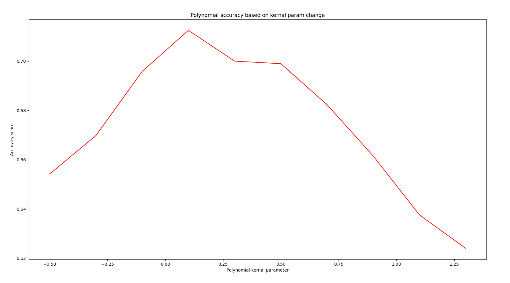
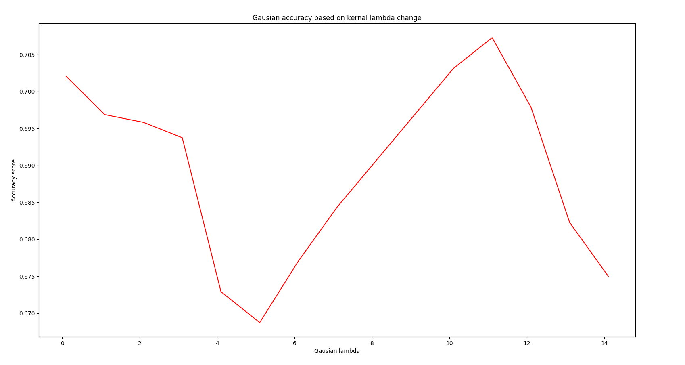
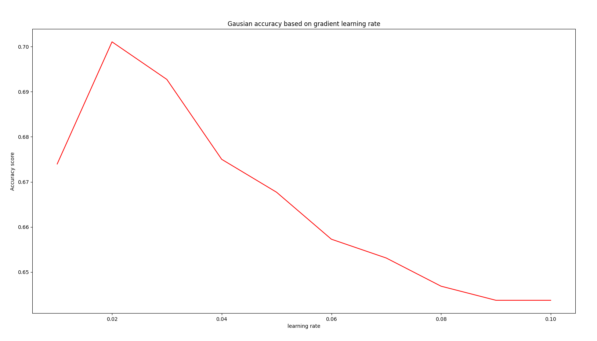
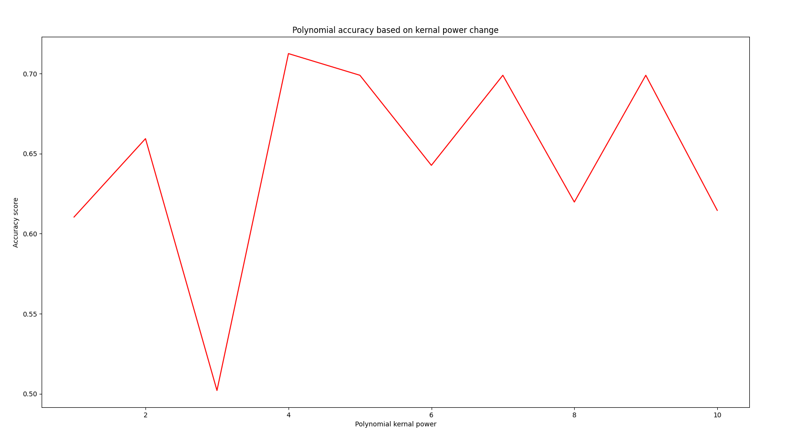

# Support Vector Machines - dual version

## Table of contents
* [General info](#general-info)
* [Technologies](#technologies)
* [Results](#results)
* [Setup](#setup)

## General info
This project is an implementation of SVM in Python. Tests was made on [winequality dataset](https://archive.ics.uci.edu/dataset/186/wine+quality). My implementation uses dual version with kernals of diferent forms.

File `SVM.py` contains main body of algorithm.

File `examples.py` allows to test SVM on given dataset.

File `SVM_sprawozdanie.py` contains repot of my experiments on this implementation writen in Polish.

### Kerner_function

This class allow to choose which kerner funcion will be used.

### Model_hyperparams

This class store hyperparameters of SVM algorithm such as learning rate or max iteration.

### SVM_algoritm

This is main class of project which can train and test SVM classifier. It uses gradient descent algorithm for improving the result.
	
## Technologies
Project is created with usage of libraries:
* numpy
* dataclasses

and tested with:
* sklearn
* pandas

## Results

	
## Setup
Fastest way to test this project is by compering it with SVM on given winequality dataset. To do it, just run `examples.py` file. 